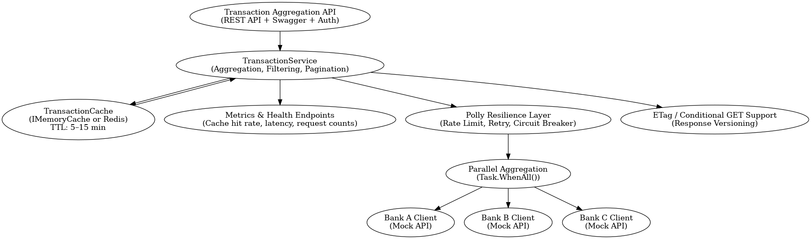
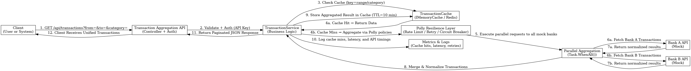
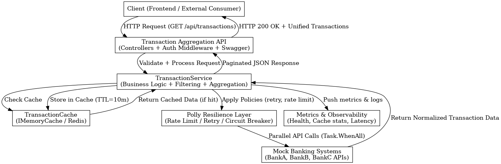

# 🏗️ Architecture Overview

The **Transaction Aggregation API** consolidates customer transactions from multiple mock banking systems into a unified JSON response.  
It supports **filtering, pagination, authentication, caching, and resilience** — designed for production-grade scalability.

---

## 🧠 High-Level Design

| Layer | Responsibility | Example Components |
|-------|----------------|--------------------|
| **API Layer** | REST endpoints for `/api/transactions` with authentication and Swagger | `TransactionsController`, `AuthMiddleware` |
| **Application Layer** | Business logic for aggregation, filtering, pagination, caching | `TransactionService`, `TransactionCache` |
| **Integration Layer** | Parallel queries to multiple mock bank APIs | `BankAClient`, `BankBClient`, `BankCClient` |
| **Infrastructure** | Observability, caching, resilience, configuration | `Polly Resilience Layer`, `MetricsService` |

---

## 🗺️ Architectural Diagram



**Key Features**
- **Authentication:** API key middleware to restrict access.  
- **Caching:** In-memory or Redis cache (TTL ≈ 10 min) to reduce latency.  
- **Resilience:** Polly policies for retry, rate-limit, and circuit-breaker logic.  
- **Parallel Aggregation:** `Task.WhenAll()` to fetch from all banks concurrently.  
- **Observability:** Health and metrics endpoints expose cache hit rate, latency, and request counts.

---

## 🔄 Sequence Flow



1. **Client Request:** Authenticated `GET /api/transactions?...`  
2. **Cache Check:** Immediate return if cached.  
3. **Resilience & Aggregation:** On miss, Polly guards external calls; parallel tasks fetch transactions.  
4. **Normalization & Caching:** Responses merged, normalized, cached.  
5. **Response:** Paginated, consistent JSON schema.  
6. **Metrics Logged:** Cache statistics and API timing recorded for monitoring.

---

## 🔌 Component Interaction



**Flow Summary**
1. The **Client** sends a request to the **API**.  
2. **TransactionService** orchestrates filtering, caching, and aggregation.  
3. **TransactionCache** returns or stores data.  
4. **Polly Resilience Layer** applies retry and rate-limit safeguards.  
5. Multiple **Mock Bank APIs** are queried in parallel.  
6. **Metrics & Observability** collect health, latency, and cache stats.  
7. **Unified JSON Response** is returned to the client.

---

## 🧩 Data Model (simplified)

```json
{
  "id": "uuid",
  "date": "2025-10-10",
  "amount": 120.50,
  "currency": "ZAR",
  "category": "Food",
  "source": "BankA"
}
```

Paginated Response:
```json
{
  "total": 123,
  "page": 1,
  "pageSize": 50,
  "transactions": [ ... ]
}
```

---

## ⚙️ Optional Enhancements
- **ETag / Conditional GETs** — reduces redundant data transfer.  
- **Rate Limiting** — protect upstream mock APIs.  
- **Circuit Breakers** — ensure degraded mode resilience.  
- **Prometheus Metrics** — for cache and latency insights.  
- **Redis Cache** — replace in-memory cache for distributed deployments.

---

## ✅ Summary

This architecture demonstrates **SE3-level design maturity**:
- Scalable and resilient structure.  
- Clear separation of concerns.  
- Production-ready operational visibility.  
- Extensible foundation for integrating real banking APIs or third-party data sources.
